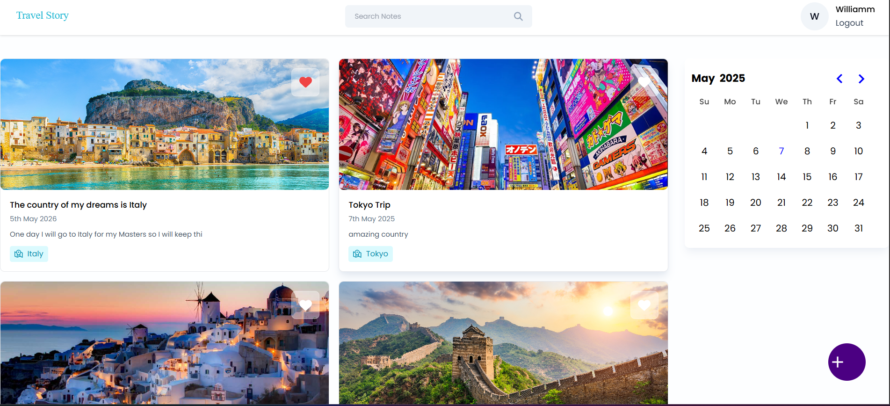
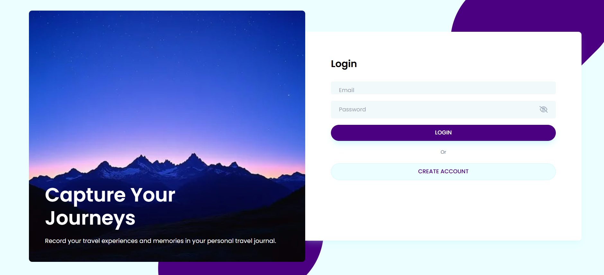
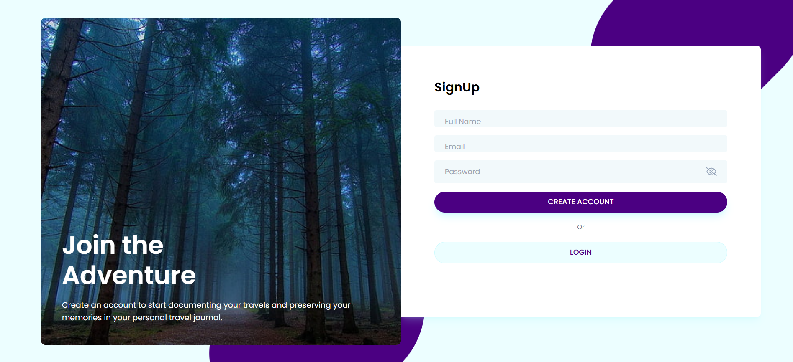
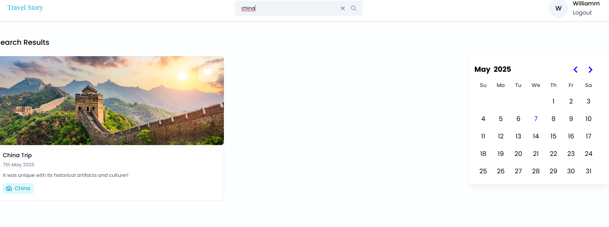
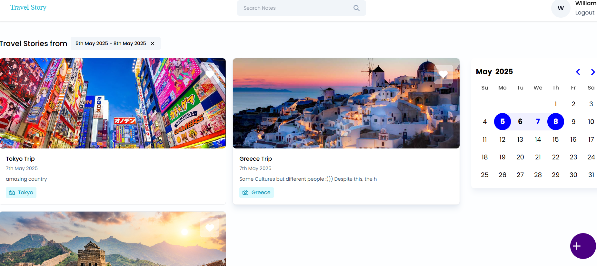
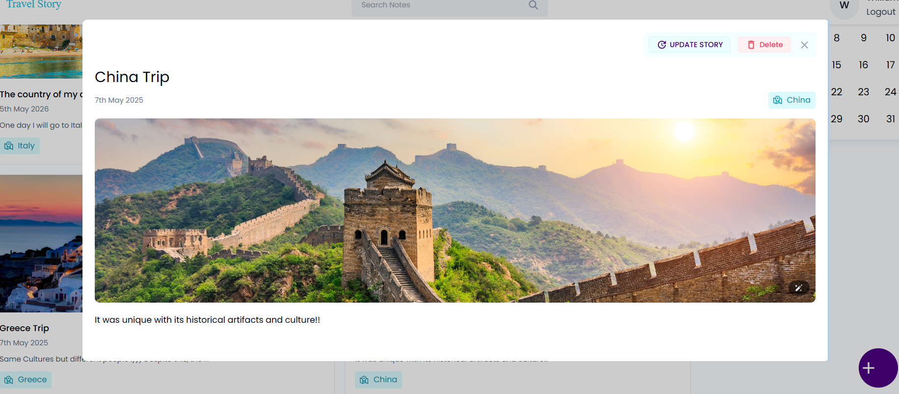
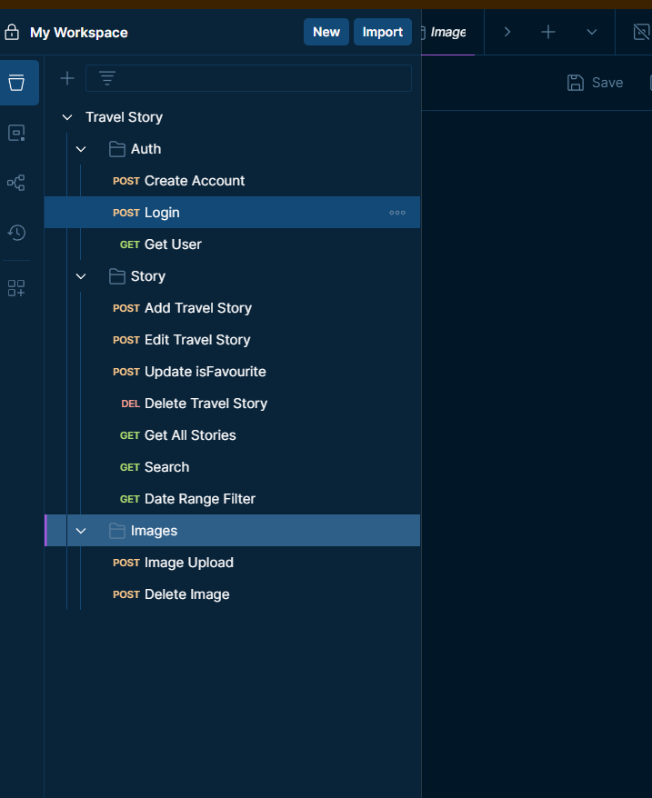

#  Travel Story 

Travel Story is a full-stack MERN application that allows users to create, store, and share their personal travel memories enriched
with dates, locations, descriptions, and images. Each user can securely sign up and log in to maintain a private digital memory book.

##  Features

-  Create, view, edit, and delete personal travel memories.
-  Add locations and dates to memories.
-  Upload photos to visually enhance each memory.
-  Secure authentication with JWT and password hashing.
-  Search and filter memories by keyword and date.
-  Filter memories by specific days.

## 🔧 Tech Stack

- **Frontend:** React.js, TailwindCSS
- **Backend:** Node.js, Express.js
- **Database:** MongoDB
- **Authentication:** JWT, bcrypt
- **Image Storage:** Cloudinary
- **API Testing:** Postman

## 📸 Screenshots

> All screenshots are stored under `frontend/travel-story-app/Screenshots`

###  Home Page
Shows the homepage after login, where all personal travel stories are listed along with options to filter, edit, or delete them.



###  Login Page
Secure login page where users authenticate with their email and password.



###  Sign Up Page
Registration form that allows users to create a secure account to store their travel stories.



### Search Functionality
Search bar where users can filter their stories using keywords (e.g., location or description terms).



###  Day Filter
Allows users to filter their stories by selecting specific date ranges, enabling easy access to memories by timeline.



###  Summer Memory Detail
An example of a memory card with a title, photo, date, and location—showcasing the visual aspect of the platform.



##  API Testing

All API routes (authentication, memory CRUD operations) have been tested using **Postman** to ensure robust and reliable backend functionality.
Postman workspace showing all tested endpoints of the backend API, including authentication, CRUD operations for stories, and image upload/delete functionality.



## 🗂️ Project Structure
 * 1- Clone the repository:
   ```bash
   git clone https://github.com/your-username/travel-story.git

* 2 - Navigate to backend and frontend folders and install dependencies: 
cd backend
npm install

cd ../frontend/travel-story-app
npm install

